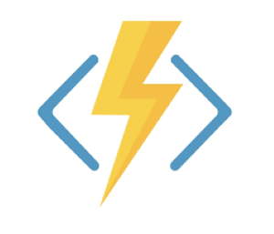
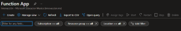
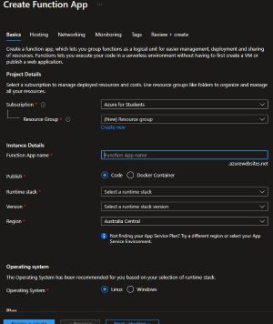
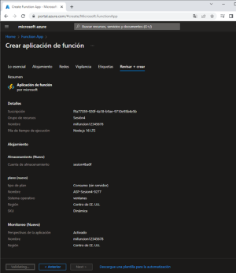

# PRACTICA DE CREACION DE UNA FUNCION

El programa que usaremos para crear una funcion es **Azure Functions**

**Azure Functions** es un servicio que **NO usa servidor**, en otras palabras es **Informatica SIN SERVIDOR**.

Literalmente tu no haces nada, lo unico que debes hacer es programarlo.

Este servicio no sirve para hacer **BACKED**.

- **Modelo de servicio:** PaaS-Serverless.

- **Cobro:** Este servicio cobra por evento t tamaño del evento **(lo puededes dejar ENCENDIDO si quieres,pero cada que lo usas o lo llamas, te cobrara)**.

- **Cuando Usar:** Se usa para hacer mcroservicios o APIs.

- **Funcion:** Abstrae toda la ifraestructura necesaria.

- **Cuando usar:** Puede usarse para hacer servicios de mensajeria, loT, APIs sencinllas,etc.

----------------------------------------

#### Pasos para crear un Azure Functions

1.- Ingresamos al [Portal de Azure](https://portal.azure.com)

2.- Buscamos Azure Functions.

3.- Cuando cargue, le daremos en crear.

4.- Creamos un grupo de recursos, pero si ya tenemos un grupo de recursos echos, lo seleccionaremos.
5.- Escribimos el nombre a la funcion y selecionamos que el Publish sea code
6.- En runtime stack seleccionamos el lenguaje de programacion que usaremos y selecionamos una region
7.- Elegir que sistema operativo queremos y que el plan type en este caso sea consumption (serverless)
8.- Le damor en **Revisar y Crear**

9.- Creamos el servicio.

10.- Una ves que le demos crear, debemos esperar un poco a que se implemente.

11.- Una ves que este ya al 100% le daremos ir al recurso.

12.- Una ves estan en el recurso, nos iremos a la seccion que dice **Functions** donde aca crearemos una funcion.

13.- Aca vamos a seleccionar el **HTTP TRIGGER**, es decir que functions recibe una peticion http y le damos crear.

14.- Esperamos que se cree el Trigger y una ves creado nos iremos a donde dice **Codigo y Prueba**.

15.- En codigo y prueba, nos mostrara la funcion en forma de codigo javascript.

16.- Ese codigo lo podemos editar para crear algo diferente.

17.- Una ves editado el codigo le podemos dar **Test/run** para ver como se visualiza lo que escribimos.

18.- Acontinuacion Obtendremos el URL de la funcion para poder visualizar la funcion mdiante otro lado.

19.- Otra forma de ver la funcion mediante el URL de la funcion, es descargando la extension de Chrome llamada **Talend API Tester**.

20.- Aca podemos ver si funciona la funcion, al momento de ejecutarla nos dice **NO AUTORIZADO**, eso pasa por que necesitamos crear una Clave de Funcion.

--------------------------------------
